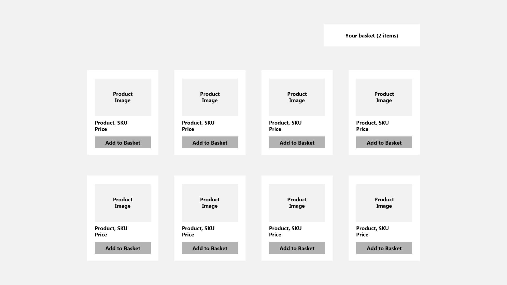

<h1 align="center">Frontend JS Challenge</h1>

  

## ✨ Introduction

Welcome to the coding challenge for developers interested in **frontend** roles in Kelisto. It's not an against-the-clock time challenge - you can complete it at home in your own time.

Ideally you will return your submission in __within 2 days__ - the sooner you get your submission back to us, the more quickly we can progress your application to interview stage.

## Exercise

In this exercise you will develop a product listing page and shopping basket. Your solution should:

- Be a website, using React.
- Consume a JSON feed of products (see below) and display them on a page.
- Allow users to add a product to their basket.
- Allow users to view the products in their basket.

## Wireframes

The following wireframes show a high-level example of the application. You're free to change this as you like.

## Product API

Please fetch the products to be displayed as JSON from this URL: [./data/products.json](./data/products.json).

## Tools, libraries and frameworks

Please build your solution as a website with React, as this is the library we use in most of our front end products.

Other than React, the choice of libraries, frameworks or tools used to develop the application is left open to you. We encourage you to use options you're familiar with, and that you'd feel comfortable explaining the choices you make with them.

Your application will be reviewed on an up-to-date version of Chrome, but you're free to include compatability for other browsers to enhance your application.

As part of the interview process, our engineers will review your code as well as your application. Please ensure the code you write can be shared with our team, for example through a GitHub or Bitbucket repository, or as a compressed folder.

## 💯 Assessment

We will assess your application based on the following criteria:

- How clean, modular and extensible the code is.
- Testing.
- Suitability of tools, libraries and frameworks used (for both the app itself and any build processes involved).
- How it looks visually and the techniques used to style the application.
- Responsive web design techniques used and the approach used for layout.
- Anything above and beyond e.g. accessibility, animation, routing.

## 🚀 Project submitting

To send us your code, you can:

- Make a fork of this repository, and send us a pull-request;
- or give access to your repository in Github/Bitbucket.

## 🤘 What’s next?

We appreciate your time is important. Once you submit your solution, our team will review your code challenge, taking your experience level into account. The sample code provided by you should be in a state considered as a "production" ready. Therefore, if you feel your unfinished code demonstrates enough for us to assess the application please leave some notes in your `README.md` explaining what you would do next given more time.

Good luck!

**“The Challenge” has been created with the sole intention of being used as a guiding document for the current recruitment process. This means we won't be using it (all or parts of it) within our projects.**
